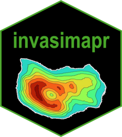

<!-- README.md is generated from README.Rmd. Please edit that file -->

# invasimapr 

<!-- badges: start -->
[](https://www.repostatus.org/#wip)
[](https://github.com/macSands/invasimapr-dev/releases)
[](https://github.com/macSands/invasimapr-dev/actions/workflows/R-CMD-check.yaml)
[](https://app.codecov.io/gh/macSands/invasimapr-dev)
<!-- badges: end -->

invasimapr is an R package to assess species and trait invasiveness and site
invasibility by visualising trait dispersion and computing invasion fitness.
The package implements a network invasibility framework that decomposes
invasion fitness into abiotic suitability, niche crowding and resident
competition components, enabling spatially explicit predictions of
establishment probability for potential invaders.

The core workflow consists of eight steps:

1. **Prepare inputs** -- assemble community, trait and environmental matrices
   from occurrence data.
2. **Simulate invaders** -- generate hypothetical invader trait profiles by
   resampling resident traits.
3. **Trait space and crowding** -- compute Gower-based trait space, convex
   hull membership and niche crowding.
4. **Resident modelling** -- fit generalised linear mixed models to resident
   abundance and derive standardised predictors.
5. **Sensitivity estimation** -- estimate trait-dependent slopes for abiotic
   suitability, crowding and competition.
6. **Invader prediction** -- project invaders into the resident model space.
7. **Invasion fitness** -- compute per-invader, per-site invasion fitness
   under multiple model options (A--E).
8. **Establishment probability** -- map fitness to establishment probability
   using probit, logistic or hard-threshold transforms.

## Installation

You can install the development version of invasimapr from
[GitHub](https://github.com/macSands/invasimapr-dev) with:

``` r
# install.packages("remotes")
remotes::install_github("macSands/invasimapr-dev")
```

## Example

A minimal example of the invasion fitness workflow:

``` r
library(invasimapr)

# Step 1: Prepare inputs from occurrence, trait and environmental data
fit <- prepare_inputs(
  occ_long  = my_occurrences,
  trait_wide = my_traits,
  env_wide   = my_environment
)

# Step 2: Simulate hypothetical invader profiles
fit <- simulate_invaders(fit, n_inv = 50, method = "columnwise")

# Step 3: Trait space and crowding
fit <- prepare_trait_space(fit)

# Step 4: Model resident abundances
fit <- model_residents(fit)

# Step 5: Learn trait-dependent sensitivities
fit <- learn_sensitivities(fit)

# Step 6: Predict invader predictors
fit <- predict_invaders(fit)

# Step 7-8: Compute invasion fitness and establishment probability
fit <- predict_establishment(fit, option = "C")

# Summarise invasiveness and invasibility
fit <- summarise_results(fit)
```

See `vignette("workflow", package = "invasimapr")` for the full
step-by-step tutorial with real data.

## Meta

- We welcome [contributions](.github/CONTRIBUTING.md) including bug
  reports.
- License: MIT
- Get [citation
  information](https://macsands.github.io/invasimapr-dev/authors.html#citation)
  for invasimapr in R doing `citation("invasimapr")`.
- Please note that this project is released with a [Contributor Code of
  Conduct](.github/CODE_OF_CONDUCT.md). By participating in this
  project you agree to abide by its terms.

## Acknowledgments

This software was developed with funding from the European Union's
Horizon Europe Research and Innovation Programme under grant agreement
ID No [101059592](https://doi.org/10.3030/101059592).
